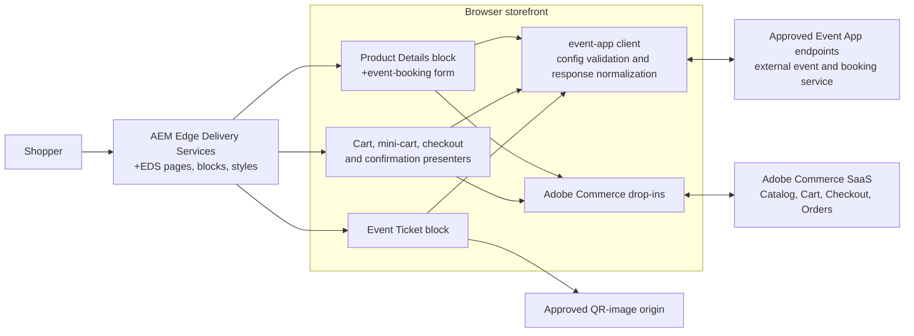
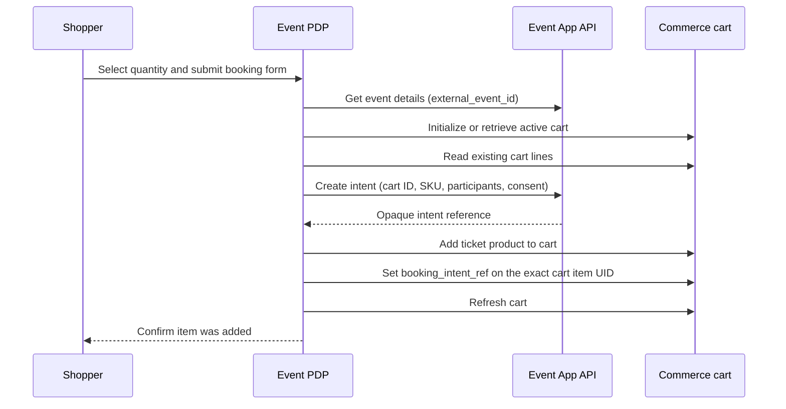

# Event Booking Storefront

This repository is an Adobe Commerce Storefront on Edge Delivery Services (EDS).
It extends the standard Commerce drop-in experience with a browser-side event
booking flow for Commerce products marked as event tickets.

The custom implementation is deliberately storefront-only. Booking data, ticket
issuance, QR generation, email delivery, and their persistence are external
services; this project consumes only their approved public HTTP contracts.

## Current implementation

The event experience is enabled for a Commerce product only when it has both of
these attributes:

- `is_event_ticket` identifies the product as an event ticket.
- `external_event_id` links the product to its event metadata.

When enabled in `config.json`, the storefront provides:

- Event metadata on the product-detail page, including date, venue, organizer,
  tags, and age requirement.
- An accessible booking form with contact details, consent, and one participant
  for each ticket quantity.
- Idempotent booking-intent creation followed by addition of the Commerce product
  to the active cart.
- A `booking_intent_ref` custom cart-item attribute that correlates the exact cart
  line with the booking intent.
- Privacy-safe booking-status panels in the cart, mini-cart, checkout, and order
  confirmation surfaces.
- A hosted ticket view that uses an opaque `booking_ref` URL parameter and renders
  only an allowlisted public ticket projection.

The standard Commerce PDP, cart, checkout, account, search, wishlist, and order
drop-ins remain in place for their normal responsibilities.

## Application architecture



EDS serves the page shell and custom blocks. The browser communicates directly
with Commerce through the installed drop-ins and with the approved Event App
endpoints through `scripts/event-app/client.js`. No credentials or private
booking data are stored in public storefront configuration.

## Booking flow



The browser retains a successful intent reference and cart-item UID only in
active form memory. On a recoverable failure, a retry repairs the same cart
correlation instead of creating a duplicate intent or adding another item.

## Repository layout

| Location | Responsibility |
| --- | --- |
| `blocks/product-details/` | Standard PDP composition plus event-product detection and booking UI. |
| `blocks/product-details/event-booking.js` | Native-DOM booking form, validation feedback, and submission lifecycle. |
| `blocks/event-ticket/` | Public ticket lookup and QR-image rendering. |
| `scripts/event-app/config.js` | Validates public Event App configuration, HTTPS URLs, actions, timeout, and QR origins. |
| `scripts/event-app/client.js` | Executes configured Event App requests and normalizes responses. |
| `scripts/event-app/cart.js` | Creates booking intents and correlates the precise Commerce cart line through GraphQL. |
| `scripts/event-app/cart-display.js` | Builds and renders safe booking summaries across cart-related surfaces. |
| `scripts/initializers/` | Configures the Commerce drop-ins. |
| `test/event-app/` | Node tests for form validation, client behavior, cart correlation, models, date formatting, and cart displays. |

## Public configuration and contract gate

Event App calls are off by default. Enable them only with an approved
`event-app` object in the environment's public `config.json`:

```json
{
  "event-app": {
    "enabled": true,
    "timeout-ms": 8000,
    "allowed-qr-origins": ["https://tickets.example.com"],
    "actions": {
      "enrich": { "url": "https://api.example.com/events", "method": "POST", "encoding": "json-body" },
      "detail": { "url": "https://api.example.com/event", "method": "GET", "encoding": "query" },
      "create-intent": { "url": "https://api.example.com/booking-intents", "method": "POST", "encoding": "json-body" },
      "ticket-get": { "url": "https://api.example.com/ticket", "method": "GET", "encoding": "query" }
    }
  }
}
```

All action URLs must be HTTPS. `GET` actions use query encoding; `POST` actions
use JSON bodies. See [Event App Storefront Configuration](event-app-configuration.md)
for the full contract and security requirements.

Do not put IMS credentials, database credentials, secrets, participant details,
booking references, intent references, ticket references, or QR secrets in this
public configuration.

Before enabling the feature in an environment, confirm that:

1. The Event App API contract and the EDS CORS allowlist are approved.
2. Commerce exposes `is_event_ticket`, `external_event_id`, and the
   `booking_intent_ref` cart-item custom attribute.
3. `create-intent` enforces one active intent per Commerce cart/SKU pair and
   supports idempotent retries via `source_request_id`.
4. Ticket lookup returns the strict public projection only, with opaque HTTPS QR
   render URLs from an approved origin.

## Local development and verification

Install dependencies, then run the storefront locally:

```sh
npm install
npm start
```

Run the event-booking unit tests and the repository linters:

```sh
npm run test:event-app
npm run lint
```

For a live booking-flow test, use an environment with approved Event App
configuration and navigate through the storefront UI to an event product. Verify
the PDP form, cart correlation panel, checkout/confirmation messages, and hosted
ticket page at desktop and mobile viewport sizes.
